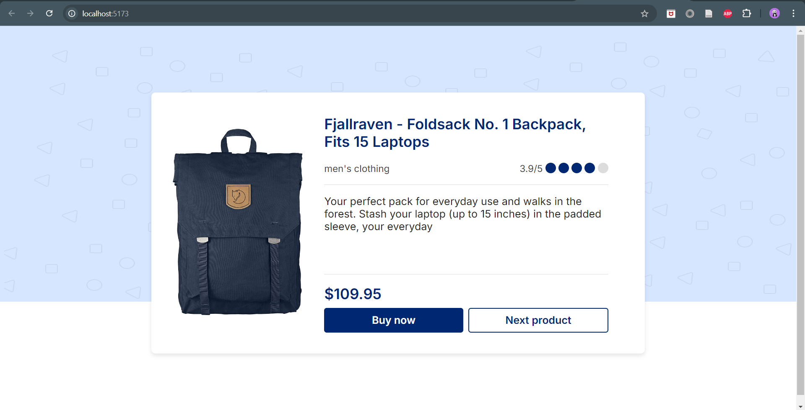
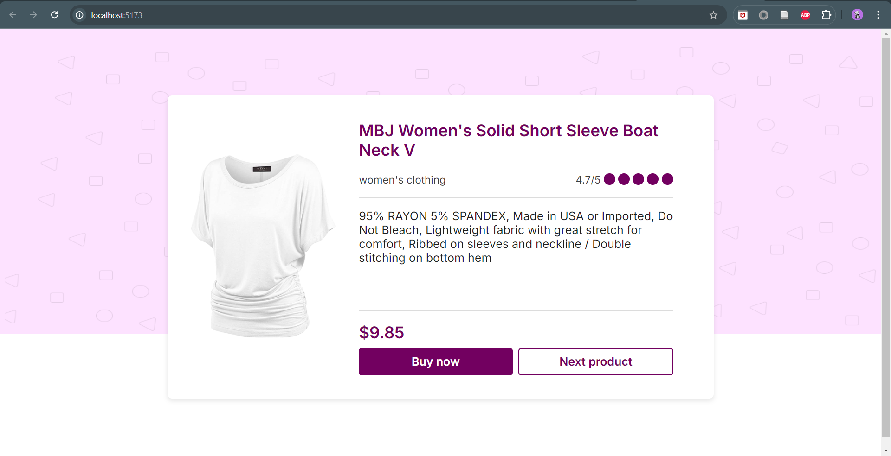
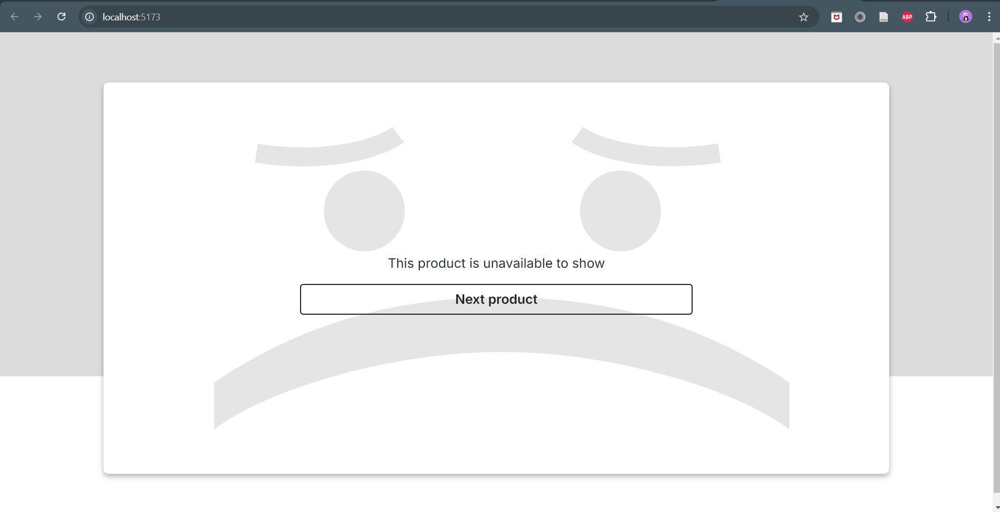

# E-Commerce Website Interface

## Description

This project aims to build the user interface of an e-commerce website that displays men's and women's clothing products. This project is part of the VIX Front End Core Initiative and involves collaboration with the UI/UX team.

## Key Features

1. **API Data Retrieval**: Utilizing the [Fake Store API](https://fakestoreapi.com) to display products. Product data is retrieved based on indexes 1-20.

   - Example URL: `https://fakestoreapi.com/products/1`

2. **Navigation Button**: Users can click the "Next Product" button to display the next product.

3. **Loader**: While waiting for a response from the API, users will see a loading element such as a skeleton to maintain a good user experience.

   - Example skeleton: [Skeleton Loader](https://dev.to/devggaurav/build-a-simple-card-skeleton-loader-component-using-html-andcss-3a20)

4. **Three Pages**: Building three pages according to the designs provided in Figma.
   - Men's Clothing
     
   - Women's Clothing
     
   - Product Unavailable
     
